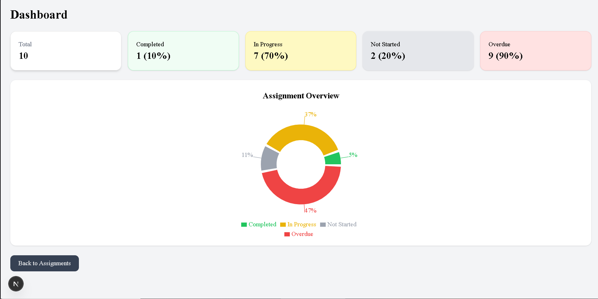
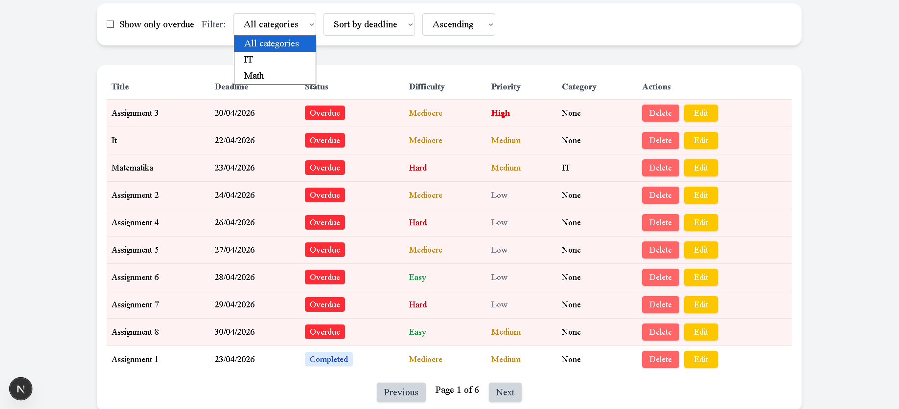
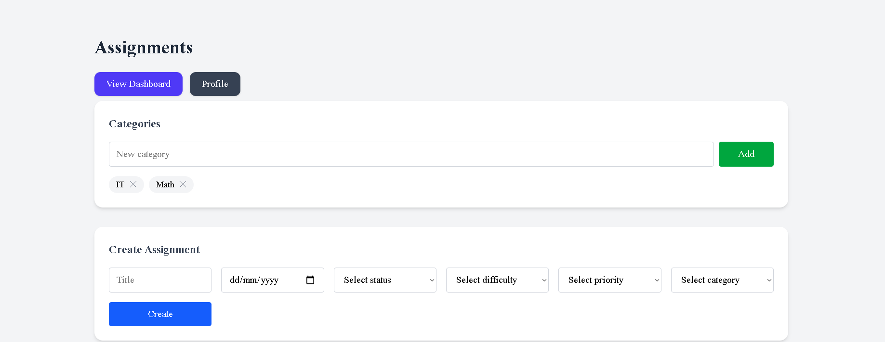
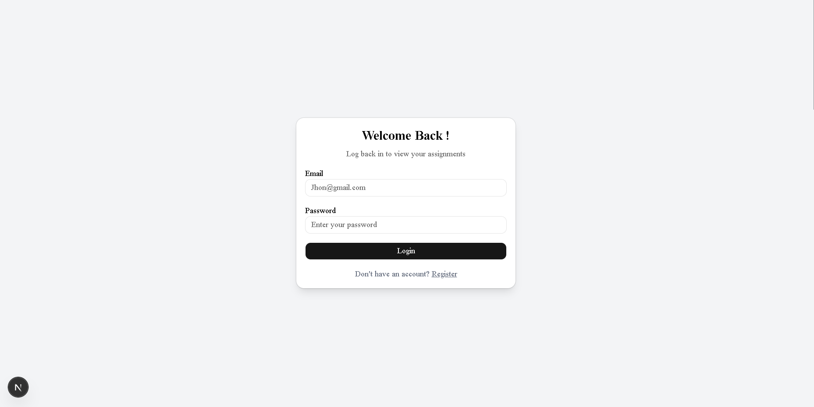
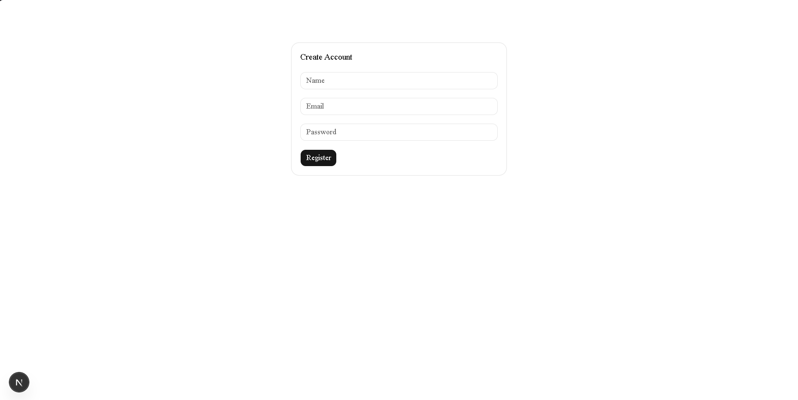

# Student Assignment Management System

A full-stack web application for managing student assignments, built using React, Prisma, PostgreSQL, and modern frontend/backend development principles.

##  Live Demo

(https://student-assignment-managements-system-simonasazs-projects.vercel.app)

### Demo Information
- You can register a new account or log in with your own credentials  
- The application is connected to a shared demo database  
- Data may be reset periodically  


## Screenshots

### Dashboard


### Assignment Management


### Forms


### Login/register




## Features

- User authentication and registration
- CRUD operations for assignments
- Relational database integration
- Assignment tracking and management
- Dynamic frontend rendering
- State management
- Responsive user interface
- Structured backend logic

## Technologies Used

### Frontend
- React
- JavaScript
- HTML/CSS

### Backend / Database
- Prisma ORM
- PostgreSQL
- REST principles

### Tools
- Git / GitHub
- Neon Database

## Setup Instructions

### 1. Clone repository

git clone https://github.com/SimonasAz/student-assignment-management-system.git

### 2. Install dependencies

npm install

### 3. Create `.env`

Copy `.env.example` to `.env

### 4. Generate Prisma client

npx prisma generate

### 5. Start application

npm run dev

## Demo Environment

This project uses a shared demo PostgreSQL database with seeded sample data for portfolio purposes.

Please avoid using real personal information when testing the application.

## (Optional) Seed Demo Data 

To populate the database with sample assignments, run:

npx prisma db seed

Before running the seed script, make sure you have created a user in the application.

Then open the `prisma/seed.ts` file and update the email field to match your user:

```ts
where: { email: "your-email@example.com" }
```

This will generate 50 sample assignments for that user.

## Project Structure

/src
/prisma
/components
/pages